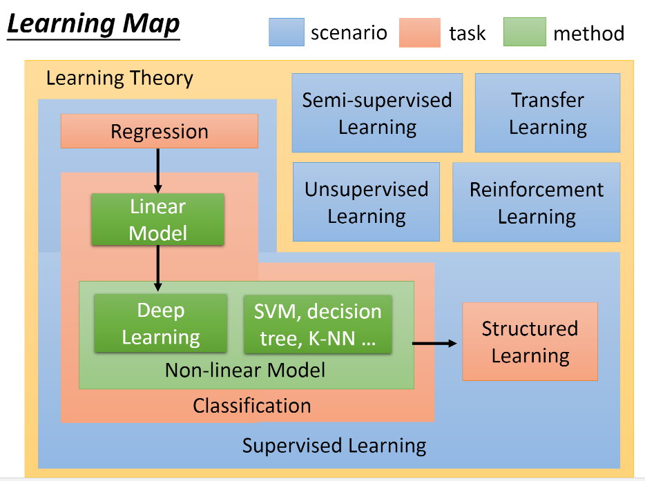

# 机器学习笔记

### 目录

[TOC]

参考资料

+  [李宏毅-NTU-机器学习](<https://www.youtube.com/channel/UC2ggjtuuWvxrHHHiaDH1dlQ>)
+  周志华 《机器学习》
+  Peter Harrington 《机器学习实战》

## 一、机器学习

### 1. 基础介绍

> [Hung-yi Lee Introduction of Machine Learning](<https://www.youtube.com/watch?v=CXgbekl66jc&list=PLJV_el3uVTsPy9oCRY30oBPNLCo89yu49&index=1>)

#### 1.1 什么是机器学习

机器学习就是从众多数据(dataset)中找出一个函数（function）$f(set)=fact​$，这个函数可能非常复杂，参数非常多。我们要做的就是找出这个函数，确定它的参数。

**这个一般分为3步**

1. 定义一个函数集合（确定函数的基本形式，如$f(x)=w*x+b, z(x)=\frac {1}{1+e^{-x}}​$等，但$w, b​$等参数待定）
2. 判断函数的好坏（根据第一步确定的函数基本形式，确定损失函数$L（f）$)
3. 选择最好的函数（对$L$求解，确定$w,b$，此时$f$ 函数性能最好）

#### 1.2 机器学习路径简略

*应用场景（scenario）*:根据可用的训练数据（training data）划分算法的应用场景

+ **监督学习（Supervised Learning）**:大量带标签（label）的训练样本，算法根据训练样本进行学习，找出相对最好的函数，通常用于预测，分类，排序等

+ **半监督学习（Semi-Supervised Learning）**：使用少量带标签数据进行学习，然后使用无标签数据进行优化

+ **迁移学习（Transfer Learning）**：使用少量带标签数据进行学习，然后使用与之前不相关的带标签的数据优化函数

+ **非监督学习（Unsupervised Learning）**：使用无标签数据进行学习，让机器自己学习如何看懂数据，分析数据，通常用于聚类，异常检测等

+ **强化学习（Reinforcement Learning）**：机器自己判定学习的成果，如果能判断对错，则为监督学习，如果不能判断则为无监督学习。通常用于自动控制，游戏AI，最优化等。Learning from critic

*任务（task）*:根据应用目标进行划分，即函数的输出类型。通常应用于监督学习。可用应用于上述5种应用场景。

+ **回归（Regression）**：函数输出是数值(scalar)。一般用于预测
+ **分类（Classification）**：函数输出是固定的离散值（分类结果）
  - 二分类（Binary）:分类结果只有两种
  - 多分类（Multi-class）：分类结果有多种
+ **结构化学习（Structed Learning）**：函数输出为结构化的内容

*方法（Method）*:解决应用问题的方法，模型。不局限应用场景和应用目标。

+ **线性模型（Linear Model）**：决策边界是否是一条直线，或者说自变量$x$受多少个待定参数影响，如$w*x, p_1*p_2*x​$，前者为线性，后者为非线性。线性多用于拟合。
+ **非线性模型（Non-linear Model）**：非线性模型内部层级，参数较多，较复杂，因此能处理较复杂的数据，应用
  + 深度学习（Deep Learning）：使用较深的网络层次学习，提取，分析数据中的隐藏关联信息
  + SVM, 决策树, K-NN...

### 2. 模型评估与选择

#### 2.1 数据处理

#### 2.2 误差分析

#### 2.2 模型评估

### 3. 监督学习

#### 3.1 线性回归

##### 3.1.1基础三步走

1）确定一个函数集合

**示例函数集合**：$f(x)= w^Tx + b​$    

数据集$D=\left \{(x_1, y_1),(x_2,y_2)...,(x_n, y_n)\right \}$

2）判断模型好坏

模型$w,b$待定，使用均方误差作为线性回归的衡量指标（常用）。当累计均方误差最小时，样本中各点到拟合曲线（函数）的距离之和最小，可以认为性能最好。

**损失函数（Loss Function）**：$L_=\sum_{i=0}^n (y_i-f(x_i))^2 = \sum_{i=0}^n(y_i-(wx_i+b))^2$

3）选择最好的函数

当损失函数$L$最小的时候，函数性能最好，需求得此时$w,b$ 。**常用梯度下降法**。

+ 基础求解 (一元)

  函数取得极值处的导数一般为0，即$L$分别对$w,b$分别求导并取0，如下
  $$
  \frac {\part L} {\part w}=2(w\sum_{i=0}^nx_i^2-\sum_{i=0}^n(y_i-b)x_i) = 0\\
  \frac {\part L} {\part b}=2(mb-\sum_{i=0}^n(y_i-wx_i)) = 0\\
  w=\frac {\sum_{i=0}^ny_i(x_i-\overline x)} {\sum_{i=0}^nx_i^2-\frac 1 m(\sum_{i=1}^nx_i)^2}\\
  b=\frac 1 m\sum_{i=0}^n(y_i-wx_i)
  $$

+ 线性代数求解（多元）

  当$w,b$是向量时
  $$
  \boldsymbol w=arg \min_w(\boldsymbol y - \boldsymbol X\boldsymbol w)^T(\boldsymbol y - \boldsymbol X \boldsymbol w)\\
  \frac {\part L} {\part w}=2\boldsymbol X^T(\boldsymbol X\boldsymbol w - \boldsymbol y)
  $$

+ **梯度下降法(Gradient Descent)**  

  > 随机选择初始$w,b​$ 计算相应的梯度值，按一定幅度（**学习率$\eta​$**）更新$w, b​$

  $$
  w^*,b^*=arg \min_{w,b}L(w,b)
  $$

  + 随机选择初始值$w_0,b_0​$
  + 计算$\frac  {\part L} {\part w}|_{w=w^0,b=b^0},\frac {\part L} {\part b}|_{w=w^0,b=b^0}​$
  + 更新$w^1=w^0-\eta\frac {\part L} {\part w} |_{w=w^0, b= b^0}, b^1 = b^0-\eta\frac {part L} {\part b}|_{w=w^0,b=b^0}​$
  + 再回到第2步，进行迭代

##### 3.1.2 正则化项

在衡量一个函数性能的时候，不仅要观察函数在训练样本上的损失$Loss_{train}​$，同时更需要观察函数在测试样本的$Loss_{test}​$，才能更好的衡量函数的泛化性能，找出最好的模型。

2.1叙述的是确定某一类函数集合内找出相对最好的函数，但这个函数在这个模型中可能并不是最好的，因此需要调整函数集合类型，加入多次项或加入更多纬度的数据。

正常情况下，加入更多的变量或加入多次项，函数越复杂，其$Loss_{train}$会越来越小。但当函数太过复杂，函数参数完全是为了贴近训练样本而进行调整，此时可能导致$Loss_{test}$反而增大，这就是**过拟合（Overfitting）**。

为了防止出现过拟合，常用的方法是在损失函数中增加正则化项（惩罚因子Regularization）
$$
L = \sum_{i=0}^n(y_i-(wx_i+b))^2 + \lambda \sum_{i=0}^n(w_i)^2
$$
$\lambda$取值一般远大于1，而且正则化项中没有$b$ ，因此在进行梯度下降参数更新时，$b$不受影响，而$w$变化幅度较小，即均方误差受$w$波动的影响较小，会使得函数**更加平滑**，结果更加准确。

#### 3.2 分类基础

##### 3.2.1 生成模型（Generative Model）和判别模型（Discriminative Model）

##### 3.2.2 逻辑回归（Logistic Regression）

#### 3.3 朴素贝叶斯

#### 3.4 支持向量机

#### 3.5 决策树

#### 3.6 K近邻

### 4. 集成学习

### 5. 半监督学习

### 6. 非监督学习

#### 6.1 聚类

#### 6.2 近邻编码

#### 6.3 自编码

## 二、机器学习实战

### K-NN

[简单K-NN实现](code/K-NN/simple/simpleK-NN.py)

[约会网站配对](code/K-NN/date/dating.py)